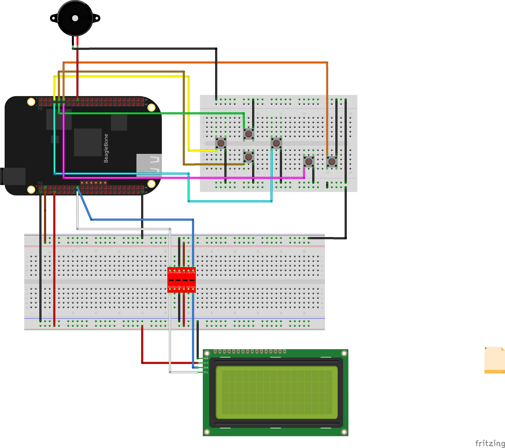

<<<<<<< HEAD
# TFG-ProyectoBBB
## Autor: Manuel Ramón Regalado Peraza
## Correo: alu0100283433@ull.edu.es
=======

# TFG-ProyectoBBB

* __Autor: Manuel Ramón Regalado Peraza__

* __Correo de contacto: alu0100283433@ull.edu.es__

### Sistema portátil emulador de teclado USB
### *(Portable system with USB keyboard emulation)*

---

<i>Operación de apertura de la terminal desde la BeagleBone</i>

### | 1. Justificación del repositorio.

En este repositorio se encuentra todo el código del proyecto. Un emulador de teclado USB basado en una BeagleBone Black. Se conectará a un PC host, permitiendo ejecutar comandos programados o actuar como un teclado.

### | 2. Elementos de hardware del proyecto.

<i>Esquema de conexionado del hardware del proyecto</i>

* Una BeagleBone Black.
* Un LCD basado en HD44780 con controladora I2C.
* Un adaptador de tensión 3,3V a 5V.
* Seis botones físicos.
* Un buzzer.
* Cables y protoboards.

### | 3. Estructura del repositorio.

	
| Directorio| Subdirectorio | Contenido |
| ----------- | ----------- |----------- |
|  ProyectoBBB | - |  Código de todo el proyecto |
| - |  shell_scripts | Diversas funcionalidades: Convertir/deconvertir las BeagleBone en un gadget USB, configuración de pines y pitidos de los buzzers. |
| - | ficheros_json | Información con las 'pantallas' a cargar en el LCD para interactuar con ellas (pantallas principales, de comandos, otras pantallas, ...)|
| - | CodigoNoLimpio | El mismo código que el proyecto, es una copia. Está sin limpiar pero presenta más comentarios y esto puede ayudar a entender mejor el código |

----

<i>Operación de cambiar Kubuntu del modo gráfico al modo texto</i>
>>>>>>> desarrollo
